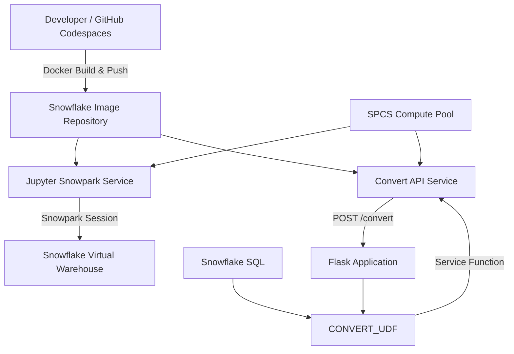

# Snowpark Container Services — Docker, Jupyter & REST API

A hands-on implementation of **Snowpark Container Services (SPCS)** demonstrating how containerized applications can be built with Docker, stored in Snowflake, deployed on managed container compute, and invoked directly from Snowflake SQL.

The project deploys two containerized workloads:

- A **Jupyter + Snowpark** environment running inside Snowflake
- A **Flask REST API** exposed to Snowflake through a Service Function

## Architecture



For a more detailed architecture breakdown, see [`docs/architecture.md`](docs/architecture.md).

## What This Project Demonstrates

The implementation covers the complete lifecycle of running custom containerized workloads inside Snowflake:

1. Configure Snowflake roles and project resources
2. Create an SPCS Compute Pool
3. Create a Snowflake Image Repository
4. Build Docker images locally
5. Test the containerized applications
6. Push Docker images to the Snowflake Image Repository
7. Define SPCS services using YAML specifications
8. Deploy containers to Snowpark Container Services
9. Connect Jupyter to Snowflake using Snowpark
10. Expose a Flask REST API through a Snowflake Service Function
11. Invoke containerized Python logic directly from SQL

## Technology Stack

| Technology | Purpose |
|---|---|
| Snowflake | Data platform |
| Snowpark Container Services | Container runtime |
| Snowpark Python | Python-to-Snowflake integration |
| Docker | Application packaging |
| Snowflake Image Repository | OCI image storage |
| Jupyter | Interactive Python environment |
| Flask | REST API |
| Snowflake Service Functions | SQL-to-container integration |
| Snowflake CLI | Deployment and administration |
| GitHub Codespaces | Development environment |

## Project Structure

```text
.
├── README.md
├── LICENSE
├── conda_env.yml
│
├── docs/
│   └── architecture.md
│
├── sql/
│   ├── 01_environment_setup.sql
│   ├── 02_container_infrastructure.sql
│   ├── 03_jupyter_service.sql
│   ├── 04_convert_api_and_function.sql
│   └── 05_cleanup.sql
│
└── src/
    ├── jupyter-snowpark/
    │   ├── dockerfile
    │   ├── jupyter-snowpark.yaml
    │   └── sample_notebook.ipynb
    │
    └── convert-api/
        ├── dockerfile
        ├── requirements.txt
        ├── convert-app.py
        └── convert-api.yaml
```

## Container Deployment Flow

Both applications follow the same container lifecycle:

```text
Application Source
       ↓
Dockerfile
       ↓
Docker Image
       ↓
Snowflake Image Repository
       ↓
Service Specification
       ↓
SPCS Service
       ↓
Compute Pool
```

The **Docker image** defines the application runtime and dependencies, while the **service specification** defines how Snowflake runs that image.

## Jupyter Snowpark Service

The first container runs a Jupyter server inside Snowpark Container Services.

The notebook establishes a Snowpark session using the OAuth token automatically provided to the container by SPCS:

```python
with open('/snowflake/session/token', 'r') as f:
    token = f.read()
```

This avoids embedding Snowflake user credentials inside the application.

The Jupyter server itself runs on the **SPCS Compute Pool**, while SQL operations initiated through Snowpark use the **Snowflake Virtual Warehouse**.

## Containerized REST API

The second container runs a Flask application exposing:

```text
POST /convert
```

The endpoint accepts Celsius values and converts them to Fahrenheit.

The core application logic is:

```python
def celsius_to_fahrenheit(celsius):
    return celsius * 9.0 / 5 + 32
```

The API also handles Snowflake's batched Service Function request format.

## Snowflake Service Function

The REST service is exposed inside Snowflake through a Service Function:

```sql
CREATE OR REPLACE FUNCTION CONVERT_UDF(input FLOAT)
RETURNS FLOAT
SERVICE = CONVERT_API_SERVICE
ENDPOINT = 'convert-api'
MAX_BATCH_ROWS = 5
AS '/convert';
```

This creates the following execution path:

```text
Snowflake SQL
     ↓
CONVERT_UDF()
     ↓
Service Function
     ↓
CONVERT_API_SERVICE
     ↓
POST /convert
     ↓
Flask Container
     ↓
Result returned to SQL
```

For example:

```sql
SELECT CONVERT_UDF(12);
```

returns:

```text
53.6
```

## Table-Based Processing

The Service Function can also be applied directly to table data:

```sql
UPDATE WEATHER
SET TEMP_F = CONVERT_UDF(TEMP_C);
```

The project successfully processed the sample `WEATHER` dataset through the containerized REST API.

This demonstrates how custom application logic running in Snowpark Container Services can participate directly in Snowflake data workflows.

## Compute Model

The project uses two different Snowflake compute concepts:

| Workload | Compute |
|---|---|
| Jupyter server | SPCS Compute Pool |
| Flask REST API | SPCS Compute Pool |
| Snowflake SQL queries | Virtual Warehouse |
| Snowpark SQL execution | Virtual Warehouse |

The **Compute Pool** provides CPU and memory for containerized workloads.

The **Virtual Warehouse** executes SQL workloads.

## Trial Account Limitation

The original Snowflake tutorial includes an **External Access Integration** to provide outbound Internet access from SPCS containers.

This implementation was completed using a Snowflake trial account where External Access Integration was unavailable.

The demonstrated architecture remained functional because the required Python dependencies were packaged inside the Docker images and neither service required outbound Internet access during the tested workflow.

External network access was therefore intentionally omitted from the implementation.

## Verified Results

The implementation successfully demonstrated:

- Docker image creation for both applications
- Local REST API execution and testing
- Successful `POST /convert` requests
- Docker image storage in the Snowflake Image Repository
- SPCS deployment using YAML service specifications
- Jupyter access through an SPCS public endpoint
- Snowpark authentication from inside the SPCS container
- Flask execution on the SPCS Compute Pool
- SQL-to-container communication through a Service Function
- Successful `12°C → 53.6°F` end-to-end conversion
- Processing of the `WEATHER` table through the containerized API

## Key Takeaways

This project demonstrates how Snowpark Container Services extends Snowflake beyond traditional SQL and managed Snowpark runtimes.

Custom applications can be packaged as OCI-compatible container images, deployed on Snowflake-managed container compute, and integrated directly with Snowflake workloads.

The core architectural concepts are:

```text
Image Repository = what application can run
Compute Pool     = where the container runs
Service          = how the container runs
Service Function = how SQL communicates with the service
Warehouse        = where SQL computation runs
```

This separation makes it possible to combine traditional Snowflake data processing with custom containerized application logic while keeping the workloads inside the Snowflake platform.

## Cleanup

Project resources can be removed using:

```text
sql/05_cleanup.sql
```

The cleanup script removes the SPCS services, compute pool, project database, warehouse, and project role.

## Source

This project was developed as a hands-on implementation and adaptation of Snowflake's **Intro to Snowpark Container Services** developer guide.

The original tutorial workflow was adapted to reflect the available Snowflake trial environment and reorganized into a portfolio-oriented project structure.