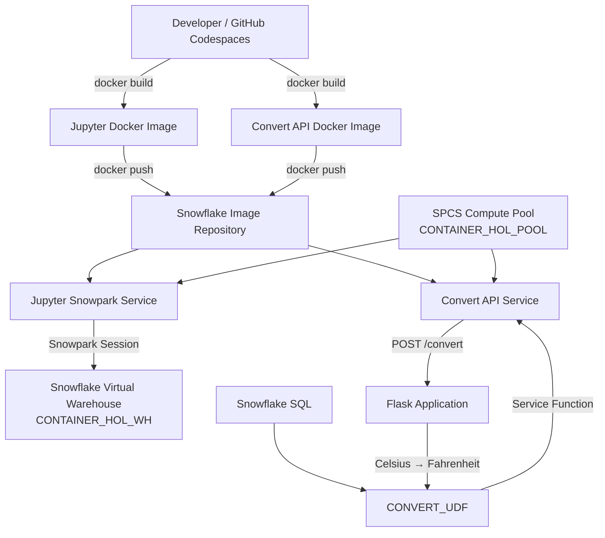

# Architecture

This project demonstrates how containerized applications can run directly inside Snowflake using **Snowpark Container Services (SPCS)**.

## High-Level Architecture



## Container Runtime

Two independent containerized workloads are deployed on the same SPCS Compute Pool.

### Jupyter Service

The Jupyter container provides an interactive Python environment running inside Snowpark Container Services.

The container authenticates to Snowflake using the SPCS-provided OAuth session token instead of embedding user credentials.

The Jupyter server itself runs on the SPCS Compute Pool, while Snowpark SQL operations use the Snowflake Virtual Warehouse.

### Convert API Service

The second container hosts a Flask REST API exposing:

```text
POST /convert
```

The endpoint receives Celsius values and returns Fahrenheit conversions.

Snowflake communicates with this service through a Service Function:

```text
Snowflake SQL
      ↓
CONVERT_UDF
      ↓
Service Function
      ↓
CONVERT_API_SERVICE
      ↓
convert-api endpoint :9090
      ↓
POST /convert
      ↓
Flask Application
```

This allows custom Python application logic running inside a container to be invoked directly from Snowflake SQL.

## Compute Model

The architecture uses two separate compute models:

| Component | Compute |
|---|---|
| Jupyter Server | SPCS Compute Pool |
| Flask REST API | SPCS Compute Pool |
| SQL Queries | Snowflake Virtual Warehouse |
| Snowpark SQL Operations | Snowflake Virtual Warehouse |

The **Compute Pool** provides CPU and memory for containers.

The **Virtual Warehouse** provides compute for Snowflake SQL workloads.

## Image and Service Lifecycle

```text
Application Source
       ↓
Dockerfile
       ↓
Docker Image
       ↓
Snowflake Image Repository
       ↓
Service Specification (YAML)
       ↓
SPCS Service
       ↓
Compute Pool
```

Each layer has a different responsibility:

- **Dockerfile** defines how the application image is built.
- **Docker Image** packages the application, runtime, and dependencies.
- **Image Repository** stores OCI-compatible images inside Snowflake.
- **YAML Service Specification** defines how Snowflake should run the image.
- **SPCS Service** represents the deployed application.
- **Compute Pool** provides the compute resources used by the running containers.

## Service Function Integration

The `CONVERT_UDF` Service Function connects Snowflake SQL with the REST API running inside SPCS.

```text
WEATHER table
     ↓
CONVERT_UDF(TEMP_C)
     ↓
CONVERT_API_SERVICE
     ↓
POST /convert
     ↓
Python conversion logic
     ↓
Fahrenheit result
     ↓
WEATHER.TEMP_F
```

This is the main integration demonstrated by the project: **SQL invoking custom containerized application logic**.

## Trial Account Limitation

The original tutorial includes an External Access Integration for outbound Internet access from SPCS containers.

The project was implemented using a Snowflake trial account where External Access Integration was unavailable.

Because the required Python dependencies were packaged inside the Docker images and the demonstrated services did not require outbound Internet access, the core architecture could still be implemented successfully.

External Internet egress was therefore intentionally omitted.

## Verified Workflow

The project successfully demonstrated the following end-to-end flow:

```text
Source Code
    ↓
Docker Build
    ↓
Local Container Test
    ↓
Snowflake Image Repository
    ↓
SPCS Compute Pool
    ↓
SPCS Service
    ↓
Service Function
    ↓
Snowflake SQL
```

Both the Jupyter environment and the Flask REST API were successfully deployed as SPCS services.

The REST API was additionally invoked from Snowflake SQL through `CONVERT_UDF`, completing an end-to-end SQL-to-container workflow.